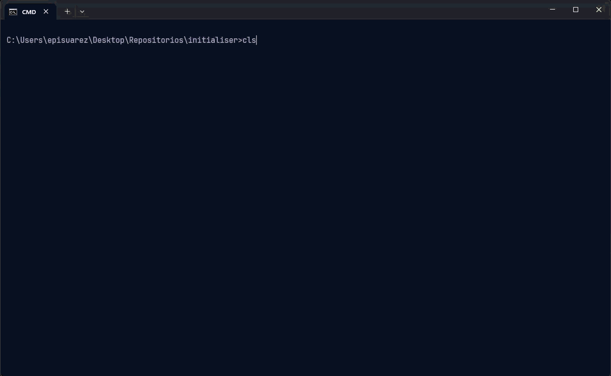

# init-claude

<div align="center">



**One command to set up Claude Code the right way — in any project.**

[](https://www.npmjs.com/package/@episuarez/init-claude)
[](https://github.com/episuarez/initialiser/releases)
[](https://github.com/episuarez/initialiser/actions)
[](./LICENSE)
[](https://nodejs.org)
[]()
[](https://claude.ai/code)

</div>

---

## Install

> Requires Node.js ≥ 18.

**Option A — npm (recommended)**

```bat
npm install -g @episuarez/init-claude
```

**Option B — git clone (with auto-update)**

```bat
git clone https://github.com/episuarez/initialiser %LOCALAPPDATA%\init-claude
cd %LOCALAPPDATA%\init-claude && npm install --omit=dev
```

Add `%LOCALAPPDATA%\init-claude` to your PATH.
`init-claude update` will pull new versions automatically.

Then, from any project:

```bat
init-claude
```

---

## Updating

```bat
init-claude update
```

This pulls the latest version (`git pull` + `npm install`) and **never breaks again**:

- If your install is a git clone (Option B, or `install.cmd` on a machine with Git), it just updates.
- If your install is an old copy-based one (xcopy, no `.git`), `update` **auto-converts it to a git repo in place** the first time, then updates — no manual reclone.
- npm installs (Option A) update with `npm update -g @episuarez/init-claude`.

> If your install predates this auto-migration and `update` still complains it's not a git repo, re-run `install.cmd` (now clones via Git) or switch to npm. After that, `init-claude update` is all you ever need.

---

## What it does

Scans your project (languages, frameworks, size, CI, docs, design files), recommends the right Claude Code components and skills, and installs them — MCPs registered, `CLAUDE.md` written, git hooks wired.

| Component | Group | What it does |
|-----------|-------|-------------|
| **context-mode** | Core | Session memory + output sandbox. Cuts context waste by ~98%. |
| **sequential-thinking** | Core | Structured reasoning for architecture and design decisions. |
| **context7** | Core | Up-to-date library docs (React, Next.js, FastAPI…) fetched at runtime. |
| **RTK** | Core | Compresses Bash output 60–90% (git, npm, cargo, test runners). |
| **code-review-graph** | Analysis | Codebase dependency graph: impact analysis, multi-file search. |
| **serena** | Analysis | Semantic LSP: go-to-definition, find-references, precise symbol search. |
| **playwright** | Web | Browser automation, scraping, E2E testing via MCP. |
| **claude-flow** | Orchestration | Multi-agent swarm / hive-mind for large parallel tasks. |
| **SuperClaude** | Orchestration | 30 `/sc:*` workflow slash commands. |
| **husky + lint-staged** | Git | Pre-commit hooks: lint and tests before every commit. |
| **MarkItDown** | Documents | Converts PDF/Word/Excel/PPT to Markdown for Claude to read. |
| **Pencil** | Design | Vector design `.pen` files + pencil-to-code skill. |
| **Figma Dev Mode** | Design | Reads Figma designs (requires Figma desktop + Dev seat). |

**How defaults are chosen** — by cost asymmetry, not project size: zero-overhead universal wins (context-mode, sequential-thinking, context7, RTK) are always on; heavy MCPs (serena ~20 tools, playwright ~25, claude-flow +87) are pre-checked only with a real applicability signal — never just because the repo is big. claude-flow and Figma are opt-in. Anything already provided by an installed plugin or MCP is skipped to avoid duplicate tools.

**Project skills** installed per-stack: `frontend-components` · `api-design` · `unity-conventions` · `e2e-testing` · `python-quality`

---

## Usage

```
init-claude                    Interactive wizard (recommended)
init-claude --yes              Apply recommended defaults without prompts
init-claude check              Doctor: show what's installed, no changes made
init-claude update             Self-update the app (git pull + npm install)
init-claude upgrade            Update installed components (npm, pipx, cargo)
init-claude add-skill <id>     Install a skill from the built-in catalog
init-claude add-skill <url>    Install a skill from any raw URL or GitHub repo
init-claude --version          Print version and exit
```

---

## Your own rules — `user-rules.md`

On first run, init-claude creates `user-rules.md` in the app directory. Anything you write below the `---` separator is injected as a section into every `CLAUDE.md` the tool generates, in every project.

- Gitignored — `init-claude update` never touches it.
- Edit once, every future run picks it up automatically.
- Per-project rules go in the `CUSTOM` block of each project's `CLAUDE.md` (also survives regeneration).

```
%LOCALAPPDATA%\init-claude\user-rules.md   ← global personal rules (all projects)
<project>\CLAUDE.md  CUSTOM block          ← rules for that project only
```

---

## Where session memory lives

Context-mode stores data globally — not in your project:

```
~/.claude/context-mode/
├── content/     indexed tool outputs (SQLite, hashed names)
└── sessions/    session memory (same scheme)
```

Query from inside Claude Code with `ctx_search` or `ctx stats`. Don't browse the files directly.

---

## Extending the catalog

**Add a component** — edit `catalog/components.json`. No code changes needed:

```jsonc
{
  "id": "my-tool",
  "name": "My Tool",
  "group": "Analysis",
  "desc": "Short description shown in the wizard.",
  "recommendIf": ["frontend", "large"],
  "alwaysOn": false,
  "install": { "type": "npm", "pkg": "my-tool" },
  "mcp": { "name": "my-tool", "cmd": "npx -y my-tool-mcp" },
  "claudemd": "- `my-tool`: one-line hint injected into CLAUDE.md."
}
```

**Add a project skill** — drop a `.md` file in `catalog/skills/` and add a record to `projectSkills` in `components.json`.

**Remote skill registry** — create `config.json` with `{ "registryUrl": "https://..." }` pointing to a `{ "skills": [...] }` JSON. The wizard will offer those skills on every run.

See [CONTRIBUTING.md](./CONTRIBUTING.md) for full details.

---

## Installation options

**Option A — npm** installs globally via npm. Update with `npm update -g @episuarez/init-claude`. No git required.

**Option B — git clone** supports `init-claude update` (git pull + npm install) and lets you edit the catalog locally. Checks for updates once a day silently.

**Option C — `install.cmd`** — clones via Git when available (auto-updatable with `init-claude update`) and updates PATH. Without Git it falls back to a plain copy (no auto-update). Re-running it on an old copy-based install reconverts it to a git clone.

`init-claude upgrade` updates the installed *components* (Claude Code CLI, context-mode, pipx packages, RTK) regardless of which installation option you used.

---

## Requirements

- **Node.js** ≥ 18
- **Git** (option A + auto-update)
- **Claude Code** CLI — `npm install -g @anthropic-ai/claude-code`
- **Python + pipx** — optional (code-review-graph, MarkItDown, SuperClaude)
- **Rust + cargo** — optional (RTK)
- **uv** — optional (serena)

---

## License

MIT with Commons Clause. Free for personal, open-source, and internal use. Attribution required on forks. Commercial redistribution requires a separate license — [contact](mailto:11500823+episuarez@users.noreply.github.com).

See [LICENSE](./LICENSE) for full terms.

---

## Author

**Epifanio Suárez Martínez** — if you fork this, keep the attribution. If you build something commercial on top of it, let's talk.
