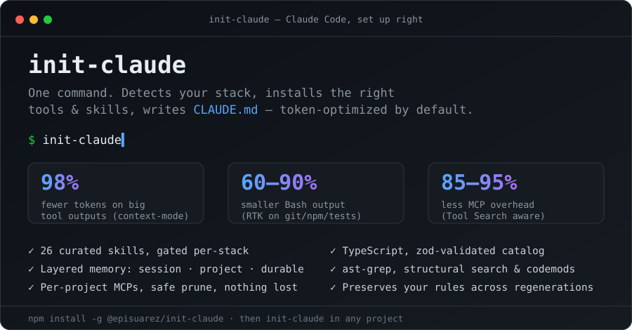

# init-claude

<div align="center">



**Set up Claude Code the right way — in any project, with one command.**

Detects your stack → installs the right MCPs, tools and skills → writes a clean, token-optimized `CLAUDE.md`. No copy-paste, no guesswork.

[](https://www.npmjs.com/package/@episuarez/init-claude)
[](https://github.com/episuarez/initialiser/releases)
[](https://github.com/episuarez/initialiser/actions)
[]()
[](./LICENSE)
[](https://nodejs.org)
[](https://claude.ai/code)

</div>

---

## Why

Setting up Claude Code well is fiddly: which MCPs are worth their context cost? what goes in `CLAUDE.md`? how do you stop it from burning tokens? **init-claude** answers all three automatically, with a bias toward **spending as few tokens as possible**:

- **Token-optimized by default.** A minimal always-on baseline (`context-mode`, `RTK`, `context7` + a `token-efficiency` skill) does the heavy lifting; everything heavier is opt-in.
- **MCP Tool Search aware.** It knows that, with Tool Search on, an MCP's tool count no longer costs context — so it stops penalizing useful servers and recommends what actually helps.
- **Layered memory** so nothing important is ever lost — session, project (versioned), and durable personal knowledge, each in the right place.
- **One declarative catalog.** Components and 26 stack-gated skills live in `catalog/components.json` — add tools without touching code.

<div align="center">


<sub>The interactive wizard. Regenerate this clip with <code>vhs demo.tape</code>.</sub>

</div>

---

## Install

> Requires Node.js ≥ 18.

**Option A — npm (recommended)**

```bat
npm install -g @episuarez/init-claude
```

**Option B — git clone (auto-updates, lets you edit the catalog)**

```bat
git clone https://github.com/episuarez/initialiser %LOCALAPPDATA%\init-claude
cd %LOCALAPPDATA%\init-claude && npm install --omit=dev
```

Add `%LOCALAPPDATA%\init-claude` to PATH. `init-claude update` pulls new versions (the compiled `dist/` ships in the repo — no local build needed).

Then, from any project:

```bat
init-claude
```

---

## What you get

Scans your project (languages, frameworks, size, CI, docs, design files, Docker, AI deps) and installs only what fits — MCPs registered per-project, `CLAUDE.md` written, git hooks wired, skills copied into `.claude/skills/`.

<!-- COMPONENTS:TABLE START (auto-generado por scripts/gen-readme.mjs) -->
| Component | Group | Default | What it does |
|-----------|-------|---------|--------------|
| **context-mode** | Core | Core | Memoria de sesion + sandbox de tool outputs (98% ahorro con plugin). Esencial. |
| **sequential-thinking** | Core | Opt-in | Razonamiento estructurado para diseno/arquitectura. 1 tool. Opt-in (no ahorra tokens; añadelo si haces diseno no trivial). |
| **context7** | Core | Core | Docs actualizadas de librerias (React, Next, FastAPI...). 2 tools, valor casi universal. |
| **RTK (Rust Token Killer)** | Core | Core | Comprime outputs Bash 60-90% (git, npm, tests). 0 MCP tools. Install solo si hay Rust/cargo. |
| **ast-grep (sg)** | Analisis | Suggested | Busqueda y reescritura estructural por AST: refactors/auditorias multi-archivo con nodos exactos (mucho menos tokens que grep). CLI, 0 MCP tools. |
| **autoskills** | Skills | Suggested | Auto-instala skills curadas segun tu stack (React, Next, Vue, Zod, Tailwind...) desde el registro auditado de autoskills, verificadas por SHA-256. Complementa las skills de proyecto. |
| **code-review-graph** | Analisis | Suggested | Grafo del codebase: impacto de cambios, busqueda. Util con 50+ archivos. |
| **serena** | Analisis | Suggested | LSP semantico: go-to-definition, find-references precisos. ~20 tools (solo compensa en codebases grandes). |
| **playwright** | Web | Suggested | Browser automation, scraping, testing E2E. ~25 tools. |
| **husky + lint-staged** | Git | Suggested | Pre-commit hooks: lint+tests antes de cada commit. |
| **MarkItDown** | Documentos | Suggested | Convierte PDF/Word/Excel/PPT a Markdown para analisis. |
| **Pencil** | Diseno | Suggested | Diseno vectorial .pen + skill pencil-to-code. |
| **MCP Gateway (mcpjungle)** | Optimizacion | Opt-in | Consolida varios MCP servers tras un endpoint (discovery/routing). ~50% menos tokens con flota grande de MCPs. Opt-in. |
| **Figma Dev Mode** | Diseno | Opt-in | Lee disenos Figma. Modo desktop (Figma app + Dev seat) o token de acceso opcional. |
| **Obsidian (vault)** | Memoria | Opt-in | Capa DURABLE: conocimiento persistente en tu vault Obsidian (notas, decisiones, research) via filesystem MCP. Pregunta la ruta del vault. |
| **basic-memory** | Memoria | Opt-in | Capa SEMANTICA (avanzado): conocimiento durable en markdown con recall por significado/grafo (basic-memory). Requiere Python. Solo si acumulas muchas notas. |
| **codebase-memory-mcp** | Analisis | Opt-in | Knowledge graph estructural del codigo (tree-sitter, 158 langs): trace_path, get_architecture, detect_changes, impact analysis. Binario C, indexa repos grandes en segundos, ~99% menos tokens que grep file-by-file. Descarga un binario externo. |
<!-- COMPONENTS:TABLE END -->

> Table generated from `catalog/components.json` — run `npm run build:readme` after editing the catalog (also enforced in CI).

**Minimal token-optimal baseline** (always, every project): `context-mode` (98% on large outputs + session memory), `RTK` (60-90% on Bash), `context7` (avoids regenerating wrong code), and the always-on `token-efficiency` skill. Everything else is opt-in — add alternatives only if you want them.

**How the rest is chosen** — by cost asymmetry, not project size: heavy MCPs (serena ~20 tools, playwright ~25) are pre-checked only with a real applicability signal — never just because the repo is big. `sequential-thinking`, `ast-grep`, Figma, codebase-memory-mcp and MCP Gateway are opt-in (never pre-checked). Same-job components (serena / code-review-graph / codebase-memory-mcp) are mutually exclusive — the wizard makes you pick one. Anything already provided by an installed plugin or MCP is skipped to avoid duplicate tools.

---

## Skills

**26 curated project skills**, each gated to the stacks where it applies (a Python service won't get React skills). Two are always on.

| Area | Skills |
|------|--------|
| **Always on** | `token-efficiency` · `memory-discipline` |
| **Language quality** | `typescript-quality` · `python-quality` · `go-quality` · `rust-quality` |
| **Frontend** | `frontend-components` · `accessibility-wcag` · `react-performance` |
| **Backend** | `api-design` · `database-schema` · `auth-security` |
| **Testing** | `e2e-testing` · `tdd-unit-testing` |
| **Cross-cutting** | `error-handling` · `secure-coding` · `refactoring-safe` · `git-commit-hygiene` · `dependency-hygiene` · `observability-logging` · `performance-profiling` |
| **Infra** | `docker-optimization` · `ci-cd-pipelines` |
| **AI / Docs / Game** | `llm-integration` · `documentation-writing` · `unity-conventions` |

Plus, via the **autoskills** component, any stack-matched skills from the [autoskills](https://www.autoskills.sh/) registry.

---

## Memory — layered, never lossy

Memory isn't one tool, it's **layers** by scope. The baseline needs zero setup; richer layers are opt-in via the wizard's **Memory** step. Switching a store is **additive** — your old notes are never deleted.

| Layer | Tool | What lives here |
|-------|------|-----------------|
| **Session** | `context-mode` (always) | what you just did; survives `/compact` and `/clear` |
| **Project / shared** | `CLAUDE.md` CUSTOM block (always) | decisions versioned with the code, loaded every session |
| **Durable / personal** | Obsidian (opt-in) | research, long-form decisions, bugs + root cause |
| **Semantic** | `basic-memory` (opt-in, advanced) | markdown with meaning-based recall over many notes |

```bat
init-claude migrate-memory <src> <dst>
```

Copies markdown between durable stores — additive, never overwrites or deletes the source.

---

## Usage

```
init-claude                              Interactive wizard (recommended)
init-claude --yes                        Apply recommended defaults without prompts
init-claude check                        Doctor: tools, MCPs, Tool Search state, CLAUDE.md size (--json)
init-claude suggest                      AI recommender (official claude-code-setup, headless, slow)
init-claude update                       Self-update the app (git pull; dist/ is prebuilt)
init-claude upgrade                      Update installed components (npm, pipx, cargo)
init-claude add-skill <id|url>           Install a skill from the catalog or any URL/GitHub repo
init-claude migrate-memory <src> <dst>   Copy durable memory (markdown) between stores — additive
init-claude --version                    Print version and exit
```

In the wizard: **arrow keys** move, **space** toggles, **enter** confirms. In step-by-step mode, **Esc** goes back a step (instead of cancelling). Every choice shows what it *is* and what it *does* before you pick it.

---

## Your own rules — `user-rules.md`

On first run, init-claude creates `user-rules.md` in the app directory. Anything below the `---` separator is injected into every `CLAUDE.md` it generates, in every project.

- Gitignored — `init-claude update` never touches it.
- Edit once; every future run picks it up.
- Per-project rules go in the `CUSTOM` block of that project's `CLAUDE.md` — and **any `##` section you add outside it is preserved too**, migrated into CUSTOM on the next regeneration. Backups are timestamped, so a regen never destroys the previous one.

```
%LOCALAPPDATA%\init-claude\user-rules.md   ← global personal rules (all projects)
<project>\CLAUDE.md  CUSTOM block          ← rules for that project only
```

---

## Extending the catalog

**Add a component** — edit `catalog/components.json`. No code changes; the entry is validated by a zod schema at load time.

```jsonc
{
  "id": "my-tool",
  "name": "My Tool",
  "group": "Analisis",
  "tier": "suggested",              // core | suggested | available(opt-in)
  "desc": "Short description shown in the wizard.",
  "recommendIf": ["frontend", "sizable"],
  "install": { "type": "npm", "pkg": "my-tool" },
  "mcp": { "name": "my-tool", "cmd": "npx -y my-tool-mcp" },
  "claudemd": "- `my-tool`: one-line hint injected into CLAUDE.md."
}
```

**Add a project skill** — drop a `.md` file in `catalog/skills/` and add a record to `projectSkills` in `components.json` (`recommendIf` to gate it, or `"always": true`). CI checks every skill has its file.

**Remote skill registry** — create `config.json` with `{ "registryUrl": "https://..." }` pointing to a `{ "skills": [...] }` JSON; the wizard offers those on every run.

See [CONTRIBUTING.md](./CONTRIBUTING.md) for full details.

---

## How it's built

TypeScript (strict), bundled with `tsup` to a committed `dist/`. The catalog is validated by **zod** (types inferred from the schema). Tests run on **Vitest**; CI typechecks, tests, and verifies `dist/` and the README table are in sync. Distribution stays build-free for users — `git clone` + `npm install --omit=dev` runs the prebuilt `dist/`.

```bash
npm run build       # tsup → dist/init-claude.js
npm run typecheck   # tsc --noEmit
npm test            # vitest
```

---

## Requirements

- **Node.js ≥ 18** (required)
- **Claude Code** CLI — `npm install -g @anthropic-ai/claude-code` (to register MCPs)
- **Git** — for the auto-updating clone install
- **Python + pipx** — optional (code-review-graph, MarkItDown, basic-memory)
- **Rust + cargo** — optional (RTK)
- **uv** — optional (serena)

---

## License

MIT with Commons Clause. Free for personal, open-source, and internal use. Attribution required on forks. Commercial redistribution requires a separate license — [contact](mailto:11500823+episuarez@users.noreply.github.com).

See [LICENSE](./LICENSE) for full terms.

---

## Author

**Epifanio Suárez Martínez** — if you fork this, keep the attribution. If you build something commercial on top of it, let's talk.
</content>
